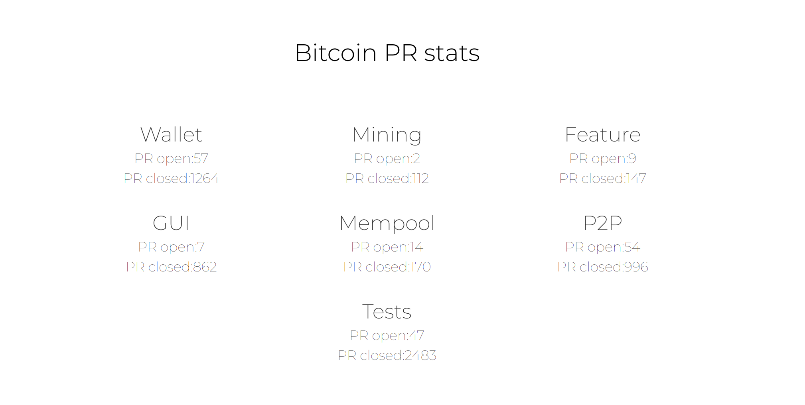

# Bitcoin Pull Request Data
This simple app displays a summary of Pull Requests open and closed on [Bitcoin Core Repo](https://github.com/bitcoin/bitcoin).

You can check the [Live App](https://bitcoin-pr-stats.herokuapp.com/)

## Local Setup
1. Clone github repo
2. Install the dependencies: ``npm i``
3. Run the server: ``npm run start``

## Labels Update
The app is tracking the following labels, as they are the most relevant ones:
- Tests
- P2P
- Mempool
- GUI
- Feature
- Mining
- Wallet

New labels can be easily added to the fetch array and to the frontend, following the same patterns.
